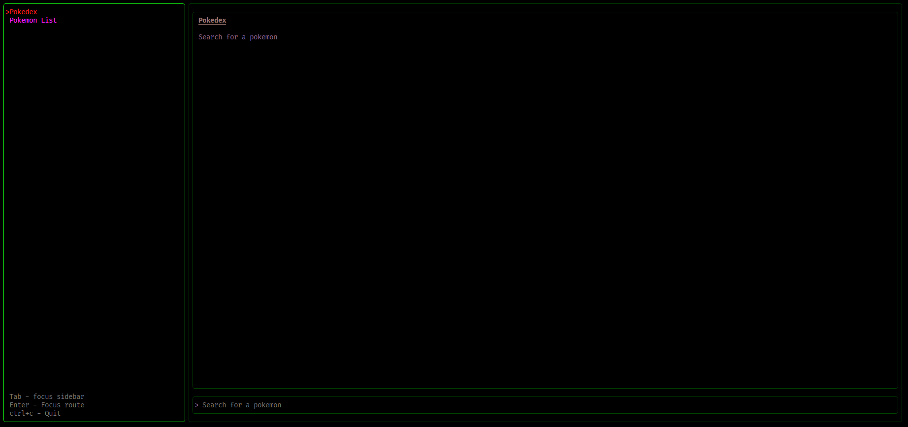
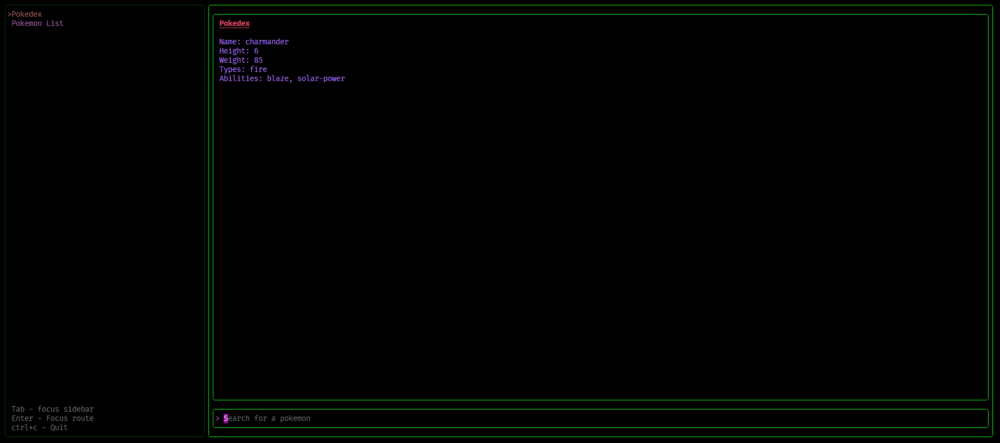
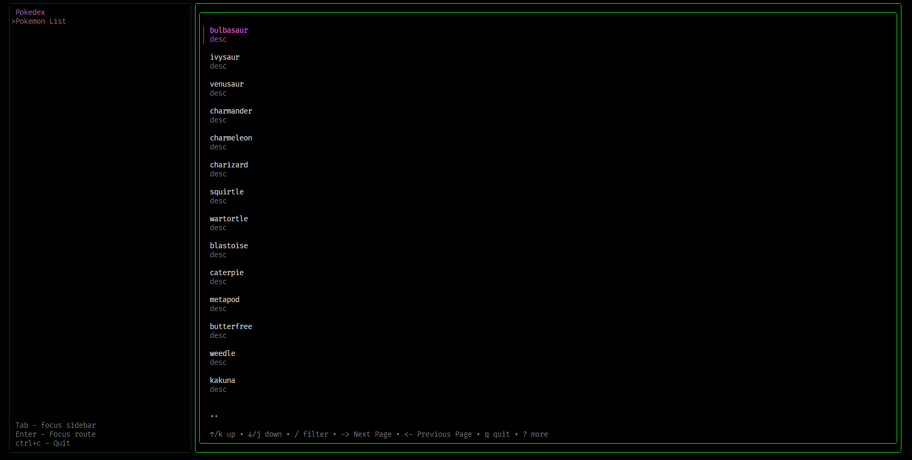

# Pokemon CLI

A CLI Pokedex application built with [Bubble Tea](https://github.com/charmbracelet/bubbletea) and [Bubbles](https://github.com/charmbracelet/bubbles), with styled ui components created using [Lip Gloss](https://github.com/charmbracelet/lipgloss), This project is riding on the PokeAPI for queries and data and displays the results in a beautiful and functional UI.

## Usage

### Routes

The sidebar used to navigate between different views in the main view section.


### Pokedex

Selecting the Pokedex will enable you to search for a pokemon details via free text input.


### Pokemon List

Selecting the Pokemon List will display a list of 20 pokemons, navigate through the current page of the list with up down arrows, and go to the next 20 with right arrow, while pressing left will redirect you to the previous 20 pokemons.

Selecting a pokemon from the list and pressing enter will redirect you to the pokemon details view.

## Features

- Search for a pokemon
- View pokemon details
- View pokemon list

## Installation

```bash
go install github.com/DimRev/pokemon-cli@latest
```

or

```bash
git clone https://github.com/DimRev/pokemon-cli.git
cd pokemon-cli
go install
```

## Usage

```bash
pokemon-cli
```

## Contributing

Contributions are welcome!
